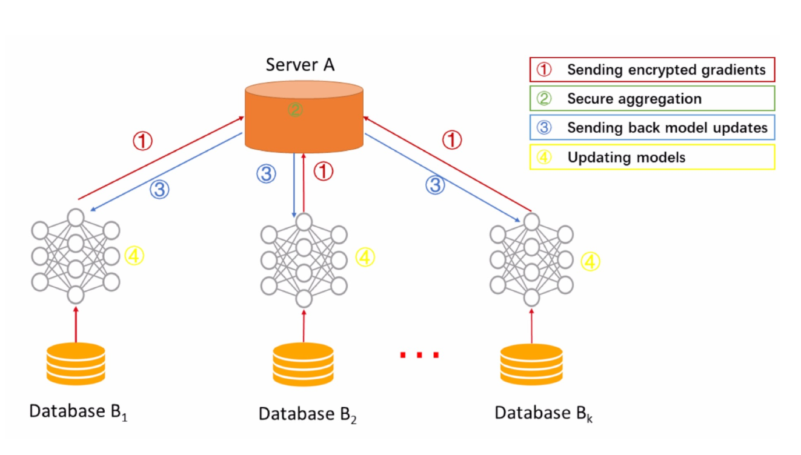
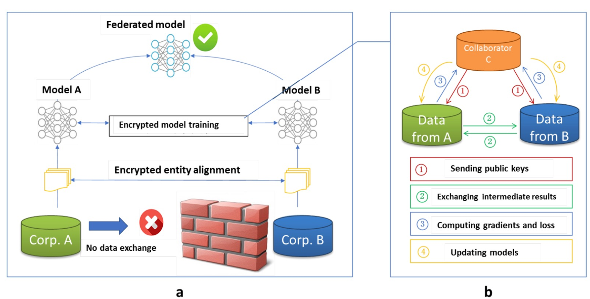
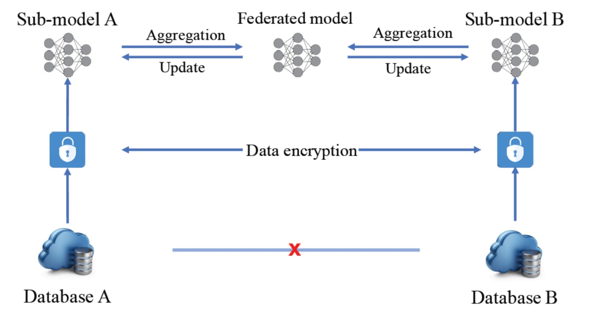
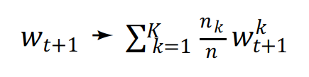
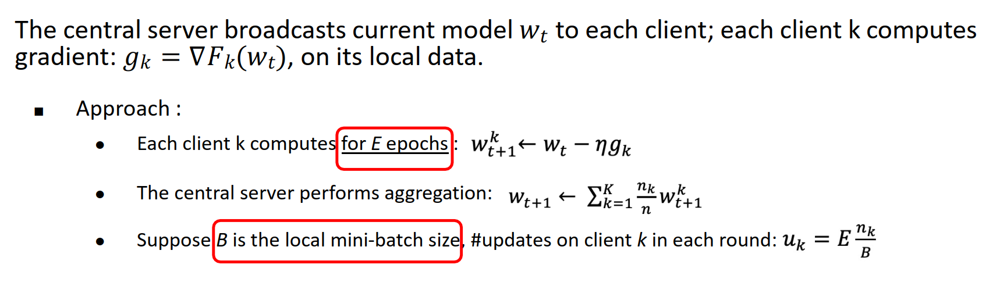
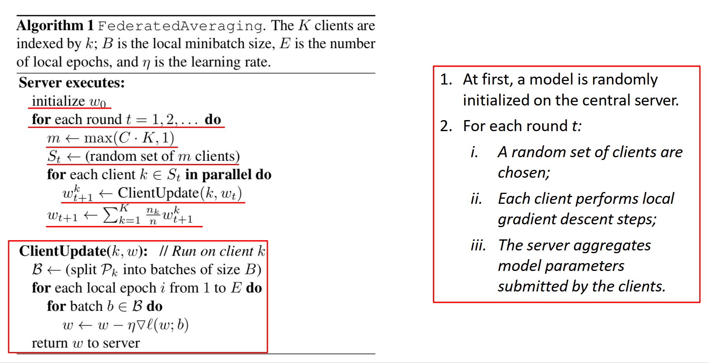

# 种类
## horizontal Fedarated learning
每个边缘edge从server获取model,在本地学习后产生gradient返回server，server随即更新。

## Vertical Fedarated learning

## Federated Transfer Learning

# Algorithms

## FederatedSGD 
 Each client k computes: $𝑤^𝑘_{𝑡+1}➛𝑤_𝑡 − 𝜂𝑔_𝑘$; the central server performs
aggregation:

*FedAvg* 

# 实验

